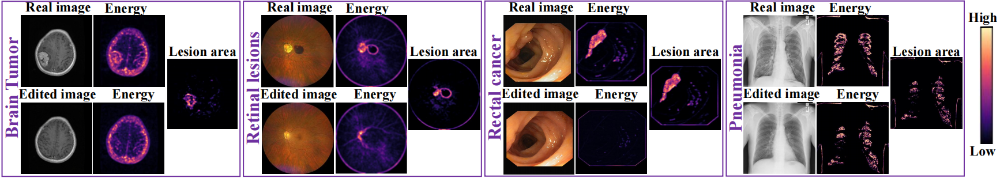
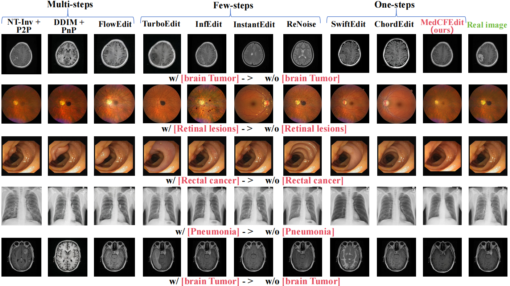
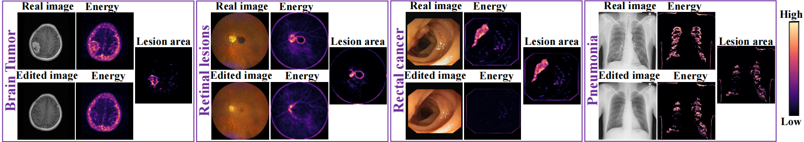
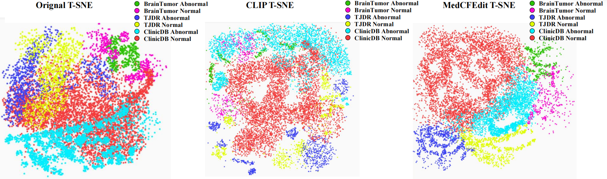

# MedCFEdit: Structure-Preserving Transport for Counterfactual Medical Editing

## Usage
### 1、Data
Including Brain Tumor, ClinicDB and TJDR

### 2、Preprocessing
Divide the dataset into rough segments to obtain the segmentation heat map

### 3、Run
run 'model_train.py'. (The code for the model module will be open-sourced during the manuscript accepted.)

### 4、Model
model:

result:

energy:

TSNE:

